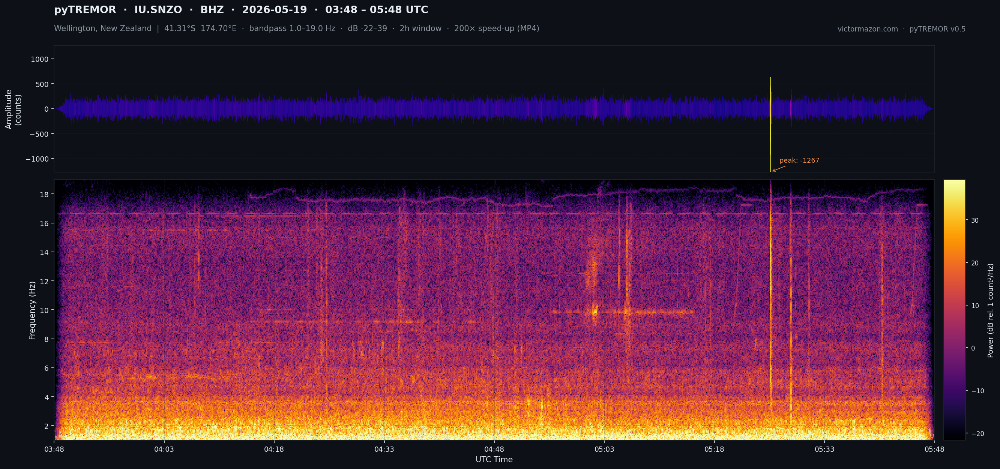

<div align="center">



**pyTREMOR — Seismoacoustics tool for real-time volcanic monitoring**

*by [Victor Mazon Gardoqui](https://victormazon.com) — with contributions by [Sonify](https://github.com/dkmiller/sonify) and support from Psy / Kräken.LABS*

  

</div>

---

## What is pyTREMOR?

**Seismoacoustics** is the combined study of vibrations in the Earth and sound waves in the atmosphere, used to characterize non-earthquake geohazards such as avalanches, landslides, and volcanic eruptions.

pyTREMOR fetches live seismic waveform data from global FDSN/EarthScope servers and **sonifies** it — converting ground motion into spectrogram video + audio (MP4). Configured for near-real-time monitoring of active volcanic regions across Oceania, Asia, and Australia, referenced from Hobart, Tasmania.

---

## How It Works

```
1. FETCH    →  Downloads raw seismic waveform data from EarthScope/FDSN (last N hours, UTC)
2. FILTER   →  Applies bandpass filter (1–18 Hz for BHZ/40 sps, 1–9 Hz for GSI/20 sps), trims and processes the signal
3. SONIFY   →  Renders frequency-coloured waveform + spectrogram + audio into an MP4 saved to dataset/
```

---

## Requirements

- Python 3.x
- [ObsPy](https://docs.obspy.org/) — seismic data access and processing
- [pygame](https://www.pygame.org/) — audio playback
- [tqdm](https://tqdm.github.io/) — progress display
- [ffmpeg](https://ffmpeg.org/) — video encoding (must be in system PATH)
- matplotlib, numpy (installed with ObsPy)

---

## Install

```bash
# Recommended (pip)
pip install obspy pygame tqdm

# Or using the included setup file
python3 setup.py install
```

> **macOS only:** After installing Python from [python.org](https://www.python.org/), run the certificate installer once to allow `urllib` (used by ObsPy) to make HTTPS connections:
> ```bash
> bash "/Applications/Python 3.12/Install Certificates.command"
> ```
> Replace `3.12` with your installed Python version. Without this step, ObsPy's service discovery will silently fail and all EarthScope-routed stations will return *"This station is not replying!"* even though the network is reachable.

---

## Sonification Output

Each station produces a spectrogram video (MP4) saved to `dataset/` with the filename format:

```
dataset/YYYY-MM-DD-HH-MM-STATION.mp4
```

The video renders as shown:

| Panel | Content |
|-------|---------|
| **Spectrogram** (top) | Power spectral density (1–18 Hz, `inferno` colormap, dB scale) |
| **Dominant frequency ridge** | Dashed white line on the spectrogram tracking the peak-power frequency over time |
| **Waveform** (bottom) | Seismic ground velocity — each segment coloured by **spectral centroid** (dominant frequency at that moment, `plasma` colormap: purple = low freq → yellow = high freq) |
| **RMS envelope** | 30-second rolling root-mean-square amplitude shown as orange fill behind the waveform, making seismic bursts and tremor modulation immediately visible |
| **Time marker** | Animated green vertical line + UTC clock advancing through the record |
| **Audio** | Waveform sonified at 200× speed-up factor |

To clear old output files:

```bash
# Linux / macOS
rm dataset/*.mp4

# Windows (PowerShell)
Remove-Item dataset\*.mp4
```

---

## Station Network — 12 active stations

| Region | Stations |
|--------|----------|
| 🇳🇿 New Zealand | SNZO (Wellington / GSN) |
| 🌊 Oceania | RABL (Rabaul/PNG), HNR (Solomon Is.), AFI (Samoa) |
| 🌏 Asia | MAJO (Japan), PET (Kamchatka), DAV (Philippines), GUMO (Mariana), GSI (Indonesia), TATO (Taiwan) |
| 🦘 Australia | MCQ (Macquarie Is.), NWAO (Narrogin / Heard Is. proxy) |

All stations use **IU (GSN)**, **AU**, or **GE** networks via EarthScope. Time windows are calculated in UTC for near-real-time accuracy. Default window: last **5 hours**.

### Station Map

The map below shows all configured stations sorted by distance from Hobart, Tasmania, with coordinates and volcanic context. Generated by `docs/generate_station_map.py`.


---

## Configuring Stations

Stations are defined in the `autoconfig` file. Each active station uses the format:

```
#LABEL{network=IU,station=SNZO,channel=BHZ,freqmin=1,freqmax=23,speed_up_factor=200,fps=1,spec_win_dur=8,db_lim=-180|-130}
```

To **add** a station: add a new `#LABEL{...}` line.  
To **disable** a station: remove the `#` prefix.  
To change the time window: edit `LASTHOURS=5` at the top.

Station parameters:

| Parameter | Description |
|-----------|-------------|
| `network` | FDSN network code (IU, AU, GE…) |
| `station` | Station code |
| `channel` | Channel code — use `BHZ` for broadband vertical |
| `freqmin` / `freqmax` | Bandpass filter range in Hz — must stay below Nyquist (use ≤18 Hz for 40 sps BHZ, ≤9 Hz for 20 sps) |
| `speed_up_factor` | Audio time compression (200 = 200× faster) |
| `db_lim` | Spectrogram colour scale range in dB |

---

## Usage

```bash
# Help
python3 pyTREMOR.py --help

# Interactive mode
python3 pyTREMOR.py --cmd

# Autorun — all configured stations, last N hours
python3 pyTREMOR.py --autorun
```

---

## Platform Support

Runs on **Windows**, **Linux**, and **macOS** with Python 3.x. All time handling uses UTC internally — local system timezone does not affect data retrieval.

| Platform | Notes |
|----------|-------|
| Windows | No extra steps required |
| Linux | No extra steps required |
| macOS | Requires SSL certificate installation — see [Install](#install) section above |

---

## Troubleshooting

### All stations fail with "This station is not replying!"

**macOS only.** Python installed from [python.org](https://www.python.org/) ships without SSL certificates for the built-in `urllib` library. ObsPy uses `urllib` for FDSN service discovery (fetching `.wadl` descriptors), so all HTTPS endpoints fail silently with `SSL: CERTIFICATE_VERIFY_FAILED` — even though `curl`, `requests`, and the browser can reach the same URLs without issue.

**Fix (one-time):**
```bash
bash "/Applications/Python 3.12/Install Certificates.command"
```
Replace `3.12` with your Python version. This symlinks [certifi](https://pypi.org/project/certifi/)'s CA bundle as Python's default SSL trust store.

**How to verify the fix worked:**
```python
from obspy.clients.fdsn import Client
c = Client('https://service.earthscope.org', timeout=30)
print(c.services.keys())  # should print: dict_keys(['dataselect', 'event', 'station', ...])
```

### Cron job runs but produces no new files

The cron environment has a restricted PATH. Ensure your cron entry sources the full Python path and logs output:
```bash
0 7-22 * * * /bin/bash /path/to/pytremor/run_pytremor.sh >> /path/to/pytremor/logs/cron.log 2>&1
```
Check `logs/cron.log` for errors. Common causes: SSL failure (see above), FDSN service outage, or stale lockfile at `/tmp/pytremor.lock`.

---

## Automating with Cron (macOS)

macOS cron has several gotchas that make it harder to set up than on Linux. Follow these steps carefully.

### 1. Grant cron Full Disk Access

macOS blocks cron from accessing user files by default. Without this, the script will silently do nothing.

1. Open **System Settings → Privacy & Security → Full Disk Access**
2. Click **+** and add `/usr/sbin/cron`
3. If `/usr/sbin/cron` is not visible in Finder: press **⌘ Shift G** in the file picker and type `/usr/sbin/`

### 2. Grant Terminal Full Disk Access (if editing crontab from Terminal)

Same path: **Full Disk Access → +** → add your terminal app (Terminal.app or iTerm2).

### 3. Edit the crontab

```bash
crontab -e
```

Add this line to run pyTREMOR every hour from 7am–10pm:

```cron
0 7-22 * * * /bin/bash /Users/yourname/pytremor/run_pytremor.sh
```

Replace `/Users/yourname/pytremor` with the actual path. The `run_pytremor.sh` script handles logging and lockfile management — do **not** redirect output again in the crontab itself.

### 4. Verify cron is running

```bash
# Check cron daemon is active
sudo launchctl list | grep cron

# Watch the log in real time
tail -f /Users/yourname/pytremor/logs/cron.log
```

A healthy log entry looks like:
```
Wed May 21 08:00:01 AEST 2026: [OK] SNZO, [OK] RABL, ...
```

### 5. Stale lockfile recovery

If pyTREMOR was killed mid-run, the lockfile may remain and block all future runs:

```bash
rm /tmp/pytremor.lock
```

Check if this is the cause: `cat /tmp/pytremor.lock` — if the PID inside is no longer running (`ps aux | grep <PID>`), the lock is stale and safe to delete.

### macOS vs Linux differences

| Behaviour | macOS cron | Linux cron |
|-----------|-----------|------------|
| Full Disk Access required | ✅ Yes | ❌ No |
| `launchd` recommended alternative | ✅ | ❌ |
| SSL certificates for Python urllib | Manual install needed | Usually pre-installed |
| PATH in cron environment | Very minimal | Minimal but broader |

> **Alternative:** macOS `launchd` (via a `.plist` file in `~/Library/LaunchAgents/`) is more reliable than cron on macOS — it persists across reboots and respects system sleep/wake cycles. Cron works but requires the above steps every time on a new machine.

---

## Known Limitations

- **GeoNet (NZ)** stations (e.g. WHVZ, KRVZ) are not supported — they require a separate endpoint (`service.geonet.org.nz`) not routed by EarthScope
- Requires a stable internet connection for FDSN data retrieval
- Very recent data (< 5 min) may not yet be available on EarthScope servers
- `dataset/` output accumulates — clear regularly with `rm dataset/*.mp4`

---

## License

pyTREMOR is released under the **GPLv3**.

---

## Contact

✉️ root /at/ victormazon.com


