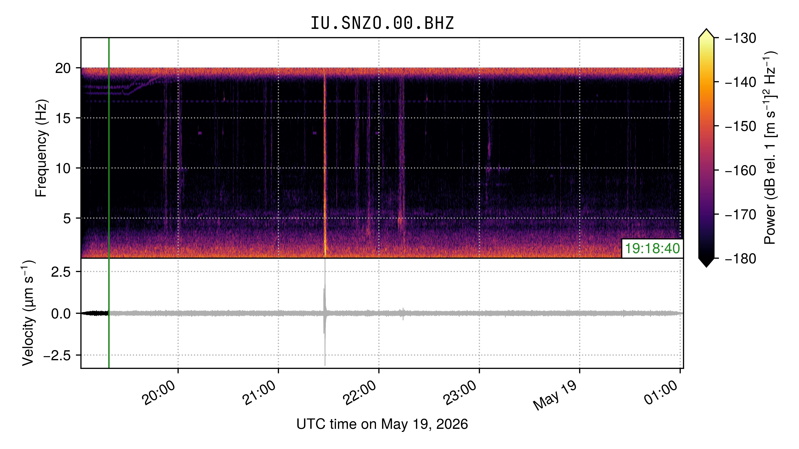
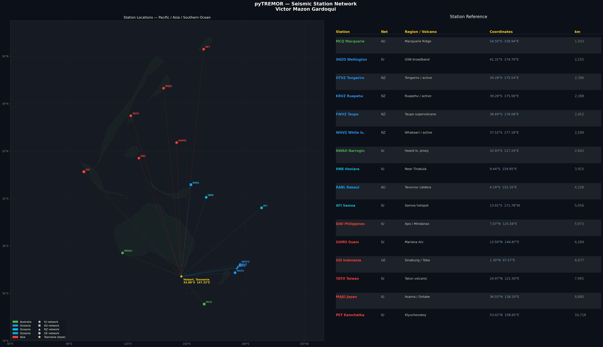

<div align="center">


**Seismoacoustics tool for real-time volcanic monitoring**

*by [Victor Mazon Gardoqui](https://victormazon.com) — with contributions by [Sonify](https://sonify.io) and support from Psy / Kräken.LABS*

  

</div>

---

## What is pyTREMOR?

**Seismoacoustics** is the combined study of vibrations in the Earth and sound waves in the atmosphere, used to characterize non-earthquake geohazards such as avalanches, landslides, and volcanic eruptions.

pyTREMOR fetches live seismic waveform data from global FDSN/EarthScope servers and **sonifies** it — converting ground motion into spectrogram video + audio (MP4). Configured for near-real-time monitoring of active volcanic regions across Oceania, Asia, and Australia, referenced from Hobart, Tasmania.

---

## How It Works

```
1. FETCH    →  Downloads raw seismic waveform data from EarthScope/FDSN (last N hours, UTC)
2. FILTER   →  Applies bandpass filter (1–23 Hz), trims and processes the signal
3. SONIFY   →  Renders spectrogram + audio into an MP4 video file saved to dataset/
```

---

## Requirements

- Python 3.x
- [ObsPy](https://docs.obspy.org/) — seismic data access and processing
- [pygame](https://www.pygame.org/) — audio playback
- [tqdm](https://tqdm.github.io/) — progress display
- [ffmpeg](https://ffmpeg.org/) — video encoding (must be in system PATH)
- matplotlib, numpy (installed with ObsPy)

---

## Install

```bash
python3 setup.py install
```

---

## Sonification Output

Each station produces a spectrogram video (MP4) saved to `dataset/` with the filename format:

```
dataset/YYYY-MM-DD-HH-MM-STATION.mp4
```

The video shows:
- **Top panel** — raw seismic waveform (ground velocity over time)
- **Bottom panel** — spectrogram (frequency content 1–23 Hz, dB scale)
- **Audio** — waveform sonified at 200× speed-up factor



---

## Station Network — 12 active stations

| Region | Stations |
|--------|----------|
| 🇳🇿 New Zealand | SNZO (Wellington / GSN) |
| 🌊 Oceania | RABL (Rabaul/PNG), HNR (Solomon Is.), AFI (Samoa) |
| 🌏 Asia | MAJO (Japan), PET (Kamchatka), DAV (Philippines), GUMO (Mariana), GSI (Indonesia), TATO (Taiwan) |
| 🦘 Australia | MCQ (Macquarie Is.), NWAO (Narrogin / Heard Is. proxy) |

All stations use **IU (GSN)**, **AU**, or **GE** networks via EarthScope. Time windows are calculated in UTC for near-real-time accuracy. Default window: last **5 hours**.

### Station Map

The map below shows all configured stations sorted by distance from Hobart, Tasmania, with coordinates and volcanic context. Generated by `docs/generate_station_map.py`.



---

## Configuring Stations

Stations are defined in the `autoconfig` file. Each active station uses the format:

```
#LABEL{network=IU,station=SNZO,channel=BHZ,freqmin=1,freqmax=23,speed_up_factor=200,fps=1,spec_win_dur=8,db_lim=-180|-130}
```

To **add** a station: add a new `#LABEL{...}` line.  
To **disable** a station: remove the `#` prefix.  
To change the time window: edit `LASTHOURS=5` at the top.

---

## Usage

```bash
# Help
python3 pyTREMOR.py --help

# Interactive mode
python3 pyTREMOR.py --cmd

# Autorun — all configured stations, last N hours
python3 pyTREMOR.py --autorun
```

---

## Platform Support

Runs on **Windows**, **Linux**, and **macOS** with Python 3.x. All time handling uses UTC internally — local system timezone does not affect data retrieval.

---

## Known Limitations

- **GeoNet (NZ)** stations (e.g. WHVZ, KRVZ) are not supported — they require a separate endpoint (`service.geonet.org.nz`) not routed by EarthScope
- Requires a stable internet connection for FDSN data retrieval
- Very recent data (< 5 min) may not yet be available on the servers
- `dataset/` can grow large — clear periodically

---

## License

pyTREMOR is released under the **GPLv3**.

---

## Contact

✉️ root /at/ victormazon.com


